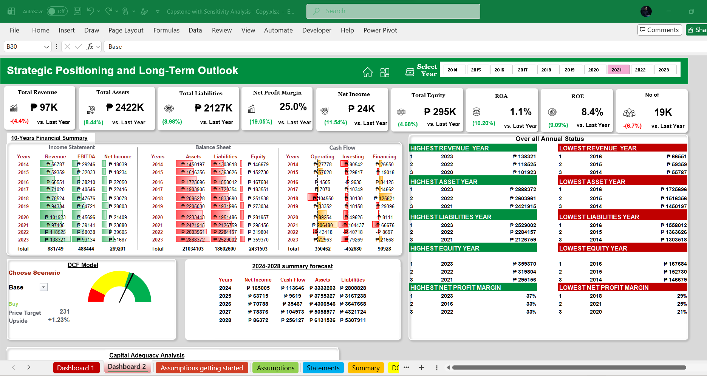
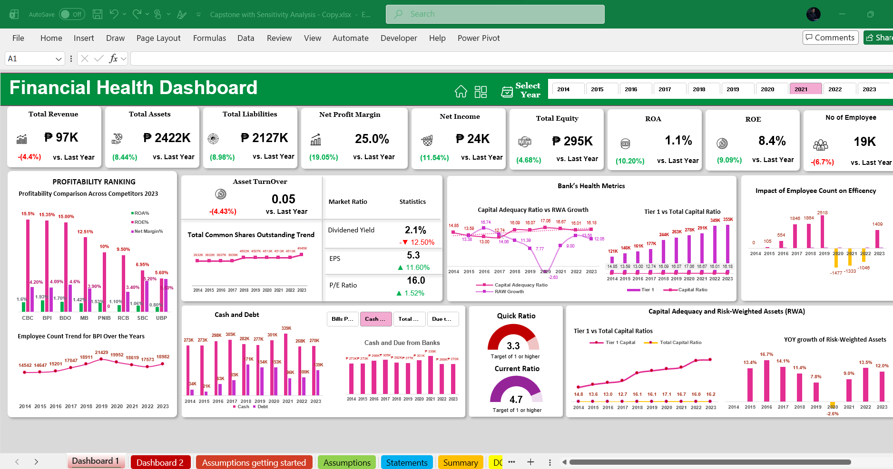
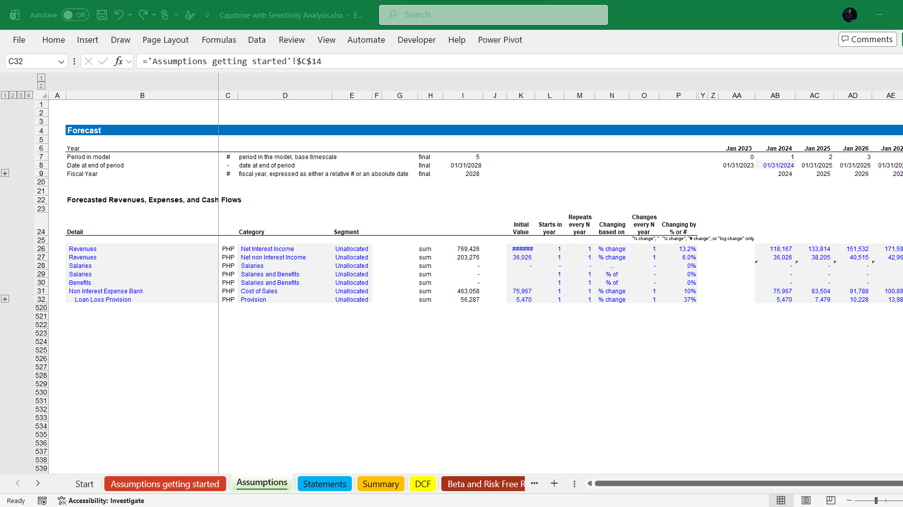
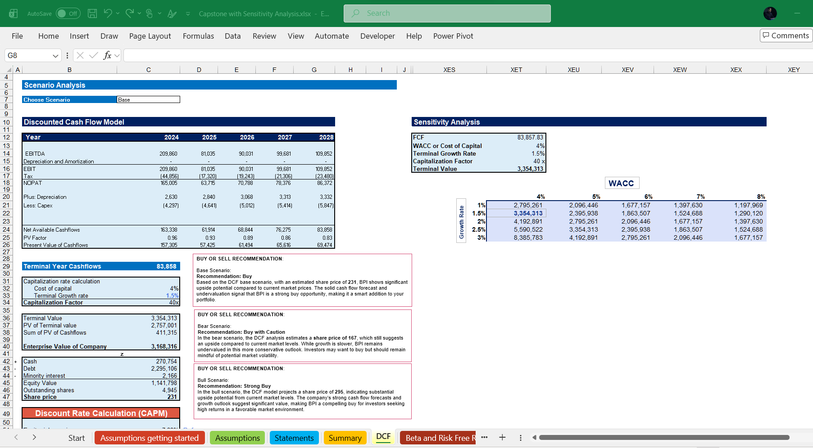
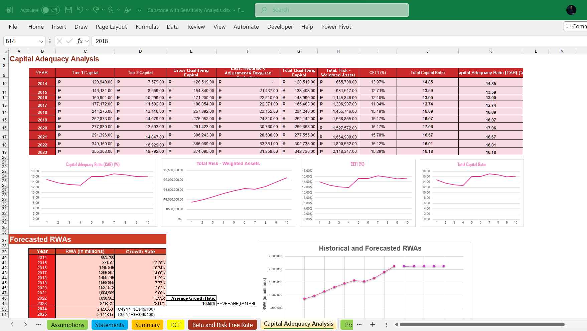

# Banking Financial Model, Forecast & Valuation

An Excel-based banking analysis model that brings historical financial statements, forecast drivers, capital and risk metrics, scenario testing, valuation, and executive reporting into one structured decision-support workflow.


> **Data and confidentiality notice**  
> This repository is a sanitized portfolio demonstration. All figures, company references, assumptions, dates, outputs, and recommendations shown should be treated as illustrative, anonymized, modified, or simulated. They do not represent current market information or an actual client deliverable. No confidential client data is included. This project is not financial or investment advice.



## Project overview

The model was designed to answer a practical question: how can historical performance, banking risk, forward-looking assumptions, and valuation be connected in a single Excel workbook without losing transparency?

It combines a ten-year analytical history with a five-year forecast framework. Assumptions flow through forecast financial statements, cash-flow and valuation outputs, while dedicated analysis pages make profitability, capital adequacy, asset quality, market ratios, and scenario outcomes easier to review.

### What the model covers

- Historical income statement, balance sheet, and cash-flow analysis
- Driver-based revenue, expense, asset, liability, and capital forecasts
- Integrated financial statements with model checks
- DCF valuation with base, bull, and bear scenarios
- WACC and terminal-growth sensitivity analysis
- Capital adequacy and risk-weighted asset analysis
- Profitability, liquidity, leverage, market, and asset-quality ratios
- Peer profitability comparison
- Loan amortization schedule
- Executive dashboards for financial health and long-term outlook

## Business problem

Reviewing banking performance across separate statements and worksheets makes it difficult to connect historical trends with future earnings, capital requirements, risk, and value. A decision-maker needs one traceable model that shows how operating assumptions affect the financial statements, ratios, valuation, and strategic outlook.

## Solution

I structured the workbook into clear analytical layers: historical inputs, assumptions, forecast schedules, statements, ratios, valuation, and presentation. Key assumptions are centralized, model checks highlight structural issues, and dashboards translate the detailed calculations into concise management views.


## Selected outputs

### Financial health dashboard

An executive view of revenue, assets, liabilities, profitability, capital, liquidity, employee efficiency, and risk-weighted assets.



### Forecast model

Central forecast drivers connect operating assumptions to projected revenue, expenses, and cash flows across the model horizon.



### DCF and scenario analysis

The valuation layer compares alternative assumptions and tests sensitivity to the discount rate and terminal-growth rate.



### Capital adequacy analysis

The model tracks qualifying capital, risk-weighted assets, capital ratios, and forward-looking adequacy trends.



## Key analytical areas

| Area | Purpose |
| --- | --- |
| Historical analysis | Establishes the performance baseline and identifies long-term movements |
| Assumption engine | Centralizes the operating and balance-sheet drivers used by the forecast |
| Forecast statements | Connects projected earnings, financial position, and cash generation |
| Ratio analysis | Evaluates profitability, liquidity, leverage, market performance, and asset quality |
| Capital analysis | Assesses capital adequacy and risk-weighted asset development |
| Valuation | Estimates value under different cash-flow, WACC, and terminal-growth assumptions |
| Scenario analysis | Shows how changes in key assumptions affect the outlook and valuation |
| Dashboards | Converts detailed calculations into concise management-level views |

## Tools and techniques

- Microsoft Excel
- Financial statement analysis
- Driver-based forecasting
- Three-statement modeling
- Discounted cash-flow valuation
- WACC and terminal-value sensitivity
- Scenario analysis
- Banking ratio and capital adequacy analysis
- Data visualization and executive dashboard design

## Repository structure

```text
banking-financial-model-forecast/
├── assets/
│   └── screenshots/          # Curated model and dashboard images
├── docs/
│   ├── CASE-STUDY.md         # Portfolio-ready project narrative
│   ├── DATA-DISCLAIMER.md    # Confidentiality and data-use notice
│   ├── GITHUB-UPLOAD.md       # Repository and website upload steps
│   └── METHODOLOGY.md        # Model structure and analytical approach
├── portfolio/
│   └── project-data.js       # Copy-ready website project object
├── .gitignore
├── LICENSE.md
└── README.md
```

## Explore the complete screenshot set

1. [Strategic outlook dashboard](assets/screenshots/01-strategic-outlook-dashboard.png)
2. [Financial health dashboard](assets/screenshots/02-financial-health-dashboard.png)
3. [Model assumptions and checks](assets/screenshots/03-model-assumptions-and-checks.png)
4. [Forecast drivers](assets/screenshots/04-forecast-drivers.png)
5. [Three-statement model](assets/screenshots/05-three-statement-model.png)
6. [Forecast financial statements](assets/screenshots/06-forecast-financial-statements.png)
7. [DCF scenario analysis](assets/screenshots/07-dcf-scenario-analysis.png)
8. [Beta and risk-free-rate inputs](assets/screenshots/08-beta-and-risk-free-rate.png)
9. [Capital adequacy analysis](assets/screenshots/09-capital-adequacy-analysis.png)
10. [Peer profitability ranking](assets/screenshots/10-peer-profitability-ranking.png)
11. [Historical balance sheet](assets/screenshots/11-historical-balance-sheet.png)
12. [Historical income statement](assets/screenshots/12-historical-income-statement.png)
13. [Historical cash flow](assets/screenshots/13-historical-cash-flow.png)
14. [Financial ratio analysis](assets/screenshots/14-financial-ratio-analysis.png)
15. [Historical market data](assets/screenshots/15-historical-market-data.png)
16. [Loan amortization schedule](assets/screenshots/16-loan-amortization-schedule.png)
17. [Forecast chart output](assets/screenshots/17-forecast-chart-output.png)

## Public-repository scope

The working Excel file and source datasets are intentionally excluded from this public portfolio package. The repository documents the model architecture, analytical approach, and presentation outputs without exposing underlying records, proprietary formulas, or confidential working material.

## Author

**James Isaac**  
Data Analyst · Business Intelligence · Financial Modeling

- Portfolio: [jamesisaac.dev](https://www.jamesisaac.dev)
- GitHub: [James-DataAnalyst](https://github.com/James-DataAnalyst)

---

If this project is useful for evaluating my work, please reference the repository rather than redistributing its images or documentation.
